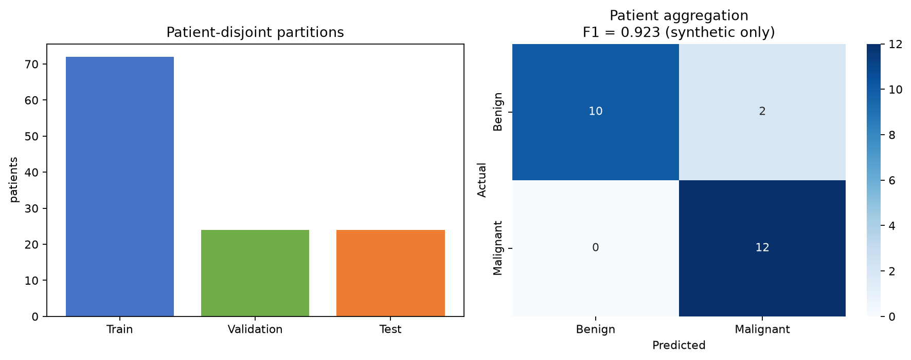

# Patient-grouped Breast Cancer Classification

[](https://github.com/Bahareh527/grouped-breast-cancer-classification/actions/workflows/ci.yml)
[](https://www.python.org/)
[](LICENSE)

A two-stage machine-learning study that classifies microcalcification feature vectors and then aggregates those predictions into a patient-level breast-cancer prediction.



## Central methodological idea

One patient can contribute many microcalcification rows. A row-level random split would place measurements from the same patient in both training and testing, producing an unrealistically easy evaluation. This project splits **patients first** and then assigns all their microcalcifications to the corresponding partition.

```text
patients ──grouped split──> train patients ──fit MC model──┐
                         ├> validation patients ─threshold─┼> patient predictions
                         └> test patients ─────evaluation──┘
```

## Tasks

1. **Microcalcification level:** predict the patient's diagnostic label from one microcalcification's extracted features.
2. **Patient level:** aggregate microcalcification predictions per patient and tune the malignant-ratio threshold using validation patients only.

The microcalcification labels reflect the patient's diagnosis; they are not pathology annotations of each individual microcalcification. Results must be interpreted accordingly.

## Improvements over the coursework notebook

- Reusable package instead of a stateful 61-cell analysis
- Explicit patient-disjoint train, validation, and test partitions
- Scaling, feature selection, and PCA contained in one fitted pipeline
- Threshold selection isolated to validation patients
- Deterministic tests for grouping, aggregation, and reproducibility
- A synthetic hierarchical demo that is clearly separated from medical results
- No student number, university email, or course dataset in the repository

## Data policy

The course-provided feature spreadsheet is deliberately excluded because its redistribution terms are unknown. Keep it locally at `data/private/features.xlsx`; `.gitignore` blocks Excel files and the entire private-data directory.

Expected schema:

```text
Patient ID | feature_001 | ... | feature_n | Label
```

`Label` must be binary (`0` benign, `1` malignant), and every row for one patient must have the same patient-level label.

## Installation and use

```bash
git clone https://github.com/Bahareh527/grouped-breast-cancer-classification.git
cd grouped-breast-cancer-classification
python -m venv .venv
# Windows: .venv\Scripts\activate
# macOS/Linux: source .venv/bin/activate
python -m pip install -e .

breast-mc-study data/private/features.xlsx
```

The command prints microcalcification- and patient-level metrics as JSON. It never modifies the source spreadsheet.

## Reproducible software demonstration

The [executed notebook](notebooks/grouped_microcalcification_demo.ipynb) uses synthetic patients and features to validate the workflow. Its metrics are software demonstrations—not clinical evidence and not results from the private course dataset.

```bash
python -m pip install -e ".[notebook,dev]"
python scripts/generate_demo.py
ruff check .
pytest
```


## Limitations and intended use

- The package is an educational research implementation, not a medical device.
- Synthetic demo performance has no clinical meaning.
- External validation on independent institutions and acquisition settings would be required before any clinical interpretation.
- The dataset's MC-level label is inherited from the patient and may not represent the intrinsic nature of each microcalcification.

## License

The repository code is released under the [MIT License](LICENSE). The excluded course dataset is not covered by this license.

